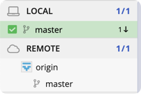
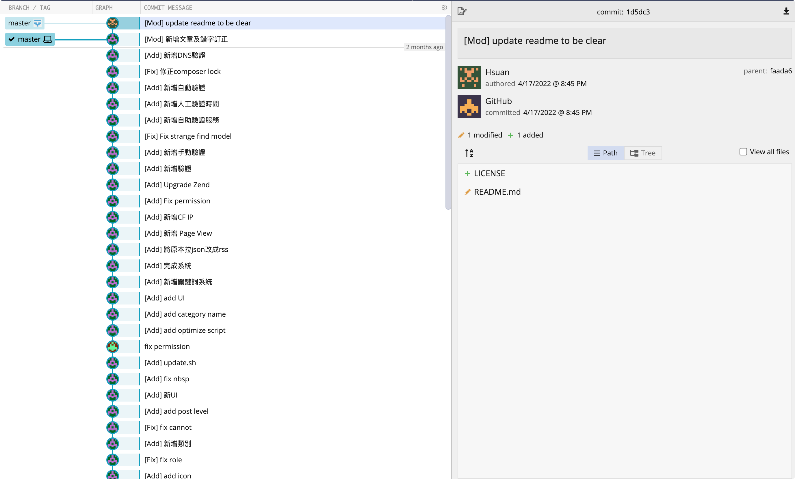
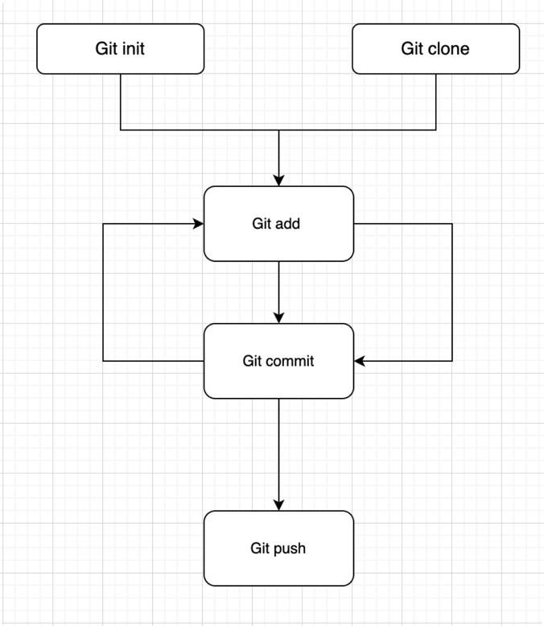
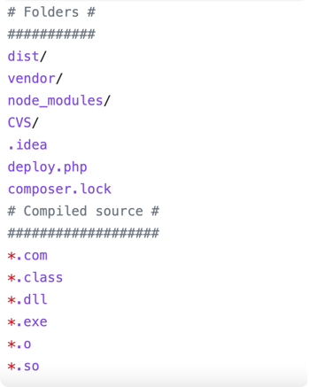

# Git

## Git 介紹
* 版本控制軟體 
* Commit、Hash、Branches 
* Local <-> Remote

  
  

## Git 流程


## clone
    Clone (copy) 複製一份遠端的專案到本地端

* Git clone 其實就是將遠端的repo拉下來本地端複製一份

Example:
```bash
git clone https://github.com/university-tw/web-book.git
```

## add
    將檔案加入暫存區

* `git add <file>` 就是把檔案加入版控中，追蹤他的變更狀態 
* 常見 `git add .` 把當前目錄所有東西都加入版控

## commit
    做完變更後新增一個紀錄

* 會追蹤目前有在版控中的檔案的變更
* Commit 後會計算一個hash （例如： df2cf5c）通常被用來追蹤開發進度
* `git commit -m "message"` 就是把檔案加入版控中，追蹤他的變更狀態

## push
    將本地端的變更推到遠端
* Git push 是在你整個專案今天都開發完了以後，要準備關電腦休息時推送

## pull
    將遠端的變更拉到本地端
* Git pull 是在你今天開始工作前，要先把遠端的變更拉下來

## .gitignore
    忽略不想被版控的檔案

* 忽略一些 **不重要** 或 **機密** 或 **套件** 檔案 ＝> 不加入版控中（也就是即使你執行 `git add .` 也不會被加入）

Example:  


