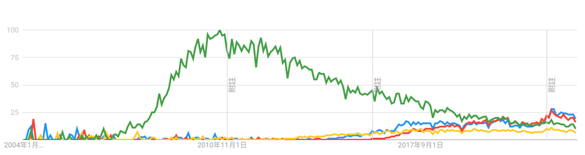
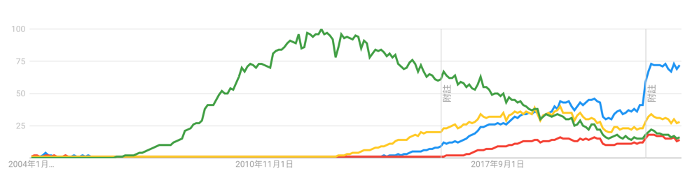

# 介紹

傳統前端技術泛指大約流行於 HTML5 問世 ~ 2018 之間的網頁前端開發技術
主要是包括最基本的 HTML , JavaScript ES5 （也與當時瀏覽器支援有關） , CSS 所構建出來的網頁
基本上當時的主流網頁運用的技術都是 jQuery + Bootstrap 函式庫，沒有當前現代前端流行的各種框架  
當時的傳統前端主要是讓網頁有一些基本的互動效果，像是滑鼠滑過、點擊、滾動等等  
而且當時的網頁也沒有像現在一樣有各種各樣的框架可以使用，所以網頁的設計也沒有現在這麼多樣化

以下提供幾個 Google 搜尋趨勢給大家，就可以知道明顯的區別了

:::info圖例：
- 綠色為 jQuery
- 藍色為 React
- 紅色為 Vue
- 黃色為 Angular
:::

下面這張台灣地區的搜尋趨勢


下面這張是全球的搜尋趨勢


:::tip你知道嗎？
猜猜為什麼 Vue 框架在台灣地區的搜尋趨勢比 Angular 高多了呢？而全球的搜尋趨勢則是相反的呢？
<details>
    <summary>答案</summary>
    <div>
        這是因為 Vue 的作者尤雨溪是大陸人，因此在中文使用地區不論是文檔或是社群都比較活躍，台灣也有非常大量的 Vue 開發者，所以在台灣地區的搜尋趨勢比較高
    </div>
</details>
:::
## HTTP Request 的演進
在傳統前端技術發展史中，曾經出現過 XMLHttpRequest 這個技術，它是一個瀏覽器提供的 API，可以讓網頁發送 HTTP Request 並取得回應。後來出現了 `ajax` 技術，透過包裝 XMLHttpRequest 的 API，讓網頁可以更方便的發送 HTTP 請求。
而當時最具代表性的就是 jQuery 的 ajax 函式了

如果要使用 XMLHttpRequest 來發送一個 GET 請求，可以這樣寫：
```js
var xhr = new XMLHttpRequest();
xhr.open('GET', 'https://example.com');
xhr.onload = function () {
    console.log(xhr.responseText);
};
xhr.send();
```

如果你要發送一個 GET 請求，使用 jQuery 可以這樣寫：
```js
$.ajax({
    url: 'https://example.com',
    type: 'GET',
    success: function (data) {
        console.log(data);
    }
});
```
是不是比 XMLHttpRequest 簡單又直觀多了呢？