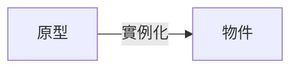

# JavaScript 的繼承關係
在 JavaScript 中，萬物皆物件，物件的繼承關係是透過原型鍊來實現的，每個物件都有一個原型物件，這個原型物件也是一個物件，而這個原型物件也有一個原型物件，這樣一直往上，直到原型物件為 null 為止，這就是原型鍊。
而如果要產生一個物件，我們需要使用 `new` 關鍵字，這個物件的原型物件就是 `new` Function （Class） 的 `prototype` 屬性。



## 原型鍊
假如我們定義以下幾個 Class（這邊以 Class 做演示因為比較易懂）：

```js
class A {}
class B extends A {}
class C extends B {}
```

如果轉換為等價的 Function 的話，就會是這樣：

```js
function A() {}
function B() {}
B.prototype = new A()
function C() {}
C.prototype = new B()
```

原型鍊是從下往上看的，也就是說 C 的原型物件是 B，B 的原型物件是 A，A 的原型物件是 null。
`__proto__` 就是原型物件，也就是說 `__proto__` 就是原型鍊的下一個物件。

## __proto__ 與 prototype
`__proto__` 的作用是當前物件的上一層級原型物件
`prototype` 是當前層級的原型物件。

```js
function A() {}
const a = new A()

a.__proto__ === A.prototype // true
```

```js
Function.__proto__.__proto__ === Object.prototype

A.__proto__.__proto__ === Object.prototype
A.prototype.__proto__ === Object.prototype
Object.prototype === null
```

`a` 是 `A` 的 instance，`A` 是 `Function` 的 instance，`Function` 是 `Object` 的 instance

這樣講好了，我們在 `new` 的時候就是把 A 微分，而取 `__proto__` 的時候就是把他積回去。
但我們積回去的結果應該加上一個常數 C ，照這個概念，所以我們不會 = A 但是會等於 `A.prototype`。

```js
function A() {}
function B() {}
A.prototype = new B()
A.__proto__ === Function.prototype // true
B.__proto__ === Function.prototype // true
A.prototype.__proto__ === B.prototype // true
```

## instanceof
`instanceof` 是用來判斷物件是否為某個 Class 的實例，也就是說 `instanceof` 是用來判斷物件的原型鍊是否有某個 Class 的原型物件。

```js
function A() {}
function B() {}
B.prototype = new A()
function C() {}
C.prototype = new B()

const c = new C()
c instanceof C // true
c instanceof B // true
c instanceof A // true
```


## 屬性的存取
在 JavaScript 中存取一個物件的屬性時，會先從自己的屬性中找，如果沒有找到，就會從原型物件中找，如果還是沒有找到，就會從原型物件的原型物件中找，直到找到為止，如果還是沒有找到，就會回傳 undefined。

```js
function A() {}
A.prototype.a = 1
function B() {}
B.prototype = new A()
function C() {}
C.prototype = new B()

const c = new C()
c.a // 1
```
